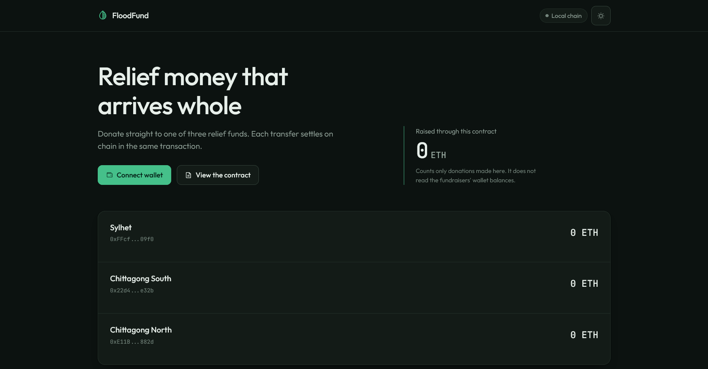
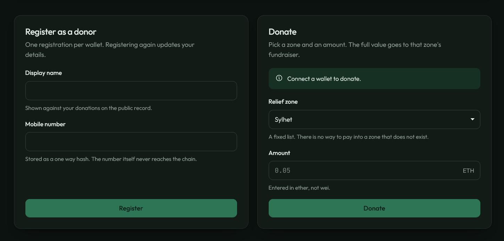

<div align="center">

# FloodFund

Donation routing for Bangladesh flood relief on Ethereum.

<div align="center">
  
  
</div>

A donor registers a wallet once, picks one of three relief zones, and the
contract forwards the full amount to that zone's fundraiser in the same
transaction. The contract never holds a balance, and every path that could leave
ether behind reverts instead.

```
Donor  ->  FloodFund  ->  Sylhet | Chittagong South | Chittagong North
              (pass-through, same transaction)
```
</div>

## Quick start

**Linux and macOS**

```bash
./setup.sh
```

**Windows**

```powershell
powershell -ExecutionPolicy Bypass -File .\setup.ps1
```

Setup checks your toolchain, installs dependencies, compiles, runs the tests,
and deploys if a local chain is already listening on port 8545.

To bring up a chain and serve the app:

```bash
npx ganache --port 8545 --chain.chainId 1337 --chain.networkId 1337 --wallet.deterministic
npm run migrate
npm run dev
```

Open http://localhost:3000 and point your wallet at `http://127.0.0.1:8545`,
chain id `1337`.

## Commands

| Command | What it does |
|---|---|
| `npm run dev` | Serve the frontend on port 3000 |
| `npm run compile` | Compile the contract |
| `npm run migrate` | Deploy to the local chain |
| `npm test` | Run the suite on an in-process chain, no node needed |
| `npm run ci` | Compile, then test |

## Layout

| Path | Contents |
|---|---|
| `contracts/FloodFund.sol` | The contract |
| `migrations/` | Deployment, wiring zones to wallets |
| `fundraisers.js` | Fundraiser wallets per network |
| `test/` | 19 tests |
| `src/` | Frontend: one page, one stylesheet, one script |
| `legacy/` | Files the rewrite replaced. Nothing loads them |

The frontend has no build step. Ethers, the fonts and the icon set are vendored,
so the page works with no network access.

## Notes

- The contract is unaudited and is not deployed to any public network.
- The hero has an image slot in `src/index.html`, left empty on purpose.

## Licence

Apache-2.0. See [LICENSE](LICENSE).
